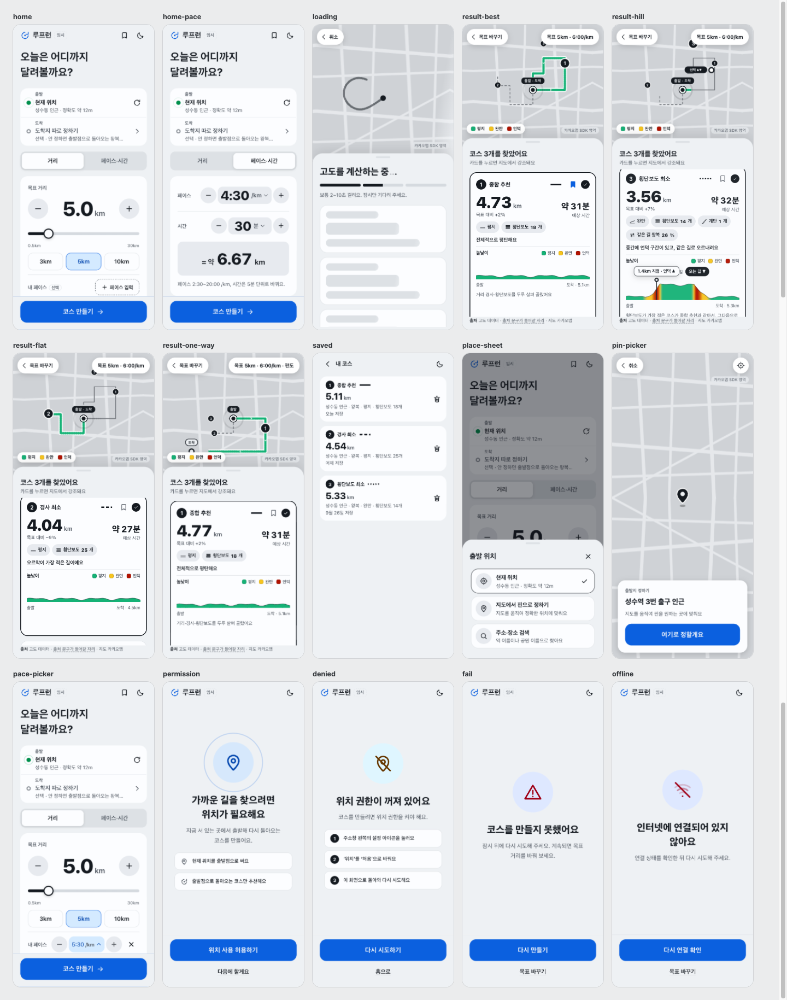

# 러닝 코스 추천 (Running Course Finder)

> 현재 위치와 목표(거리 **또는** 페이스×시간)만 입력하면, 출발점으로 돌아오는 러닝 코스 후보 3개를 만들어 준다.
> 경사, 횡단보도 수, 계단, 같은 길 되돌아오는 비율을 계산해서 고른다.

| | |
| --- | --- |
| 상태 | **1차(코스 추천) PoC 진행 중** · 2차(코스 저장 + GPS 트래킹)는 설계만 해두고 보류 |
| 작성일 | 2026-09-30 |
| 운영 방침 | 개인 프로젝트, **월 0원**(Vercel Hobby + Supabase Free + 무료 API) |
| 표기 | ✅ 실제 API로 확인함 · 🧪 가짜 응답으로만 확인함 · 📝 설계만 했고 구현 전 · ❓ 미확인 |

---

## 화면 미리보기

<picture>
  <source media="(prefers-color-scheme: dark)" srcset="assets/screens/readme-board-dark.png">
  
</picture>

GitHub 테마에 맞춰 라이트/다크가 자동으로 바뀐다. 디자인 원본은 [`docs/design/`](docs/design/HANDOFF.md).

---

## 1. 무엇을 만드나

**문제**: 지도 앱은 A→B 길찾기만 해준다. "오늘 5km 뛰고 싶은데 어디로?"에는 답이 없고, 같은 5km여도 경사와 신호 대기에 따라 체감이 크게 다르다.

**입력**
- 현재 위치 (브라우저 위치 권한)
- 목표: `거리(km)` **또는** `페이스 + 시간` (예: 6:00/km로 40분 → 6.67km로 변환해서 같은 로직을 탄다)

**출력: 서로 다른 코스 3개**

| | 기준 | 고르는 방법 |
| --- | --- | --- |
| ① 종합 추천 | 경사·횡단보도·계단·되돌아오기를 균형 있게 | 균형 점수(BALANCED)가 가장 낮은 코스 |
| ② 경사 최소 | 누적 상승고도가 가장 낮은 코스 | 상승고도 최소 |
| ③ 횡단보도 최소 | 횡단보도가 가장 적은 코스 | 횡단보도 수 최소 |

같은 코스가 여러 기준의 1위면 앞 슬롯이 가져가고, 다음 슬롯은 차순위를 보여주며 안내 문구를 붙인다.
화면에는 "신호등"이 아니라 **"횡단보도 N개"** 로 표기한다(신호 유무나 대기 시간은 데이터가 없다).

**범위**

| | 내용 |
| --- | --- |
| 1차 (지금) | 위치·목표 입력 → 후보 3개 → 지도에 3색으로 표시. 로그인·저장 없음 |
| 2차 (보류) | 코스 저장, 저장한 코스를 따라 뛰는 GPS 트래킹(시작/일시정지/완료), 페이스·시간·칼로리 |

---

## 2. 현재 상태

- [x] ✅ TMAP 키 발급, 보행자 경로안내 호출 성공
- [x] ✅ PoC `rank` 모드: 3방향 루프 생성, 거리 보정, 횡단보도·계단 카운트, 고도·겹침·점수 (실제 API, 2026-09-30)
- [x] 🧪 PoC `pick` 모드(① 종합 / ② 경사 최소 / ③ 횡단보도 최소) 구현 — **실제 API로는 아직 안 돌려봄**
- [x] ✅ 평지에 고도 오차만 있을 때의 상승고도 시뮬레이션 (→ 8장)
- [ ] 고도 진단: `elevation-*.csv` 분석, 지도에서 경로 확인, 워치·카카오맵과 비교
- [ ] `pick` 모드 실제 API 실행 (TMAP 최대 12회)
- [ ] 고도 소스 결정 (Open-Meteo 유지 / 국가 DEM 파일 / 브이월드 `dem`) 및 `ElevationProvider` 분리
- [ ] Supabase 프로젝트 + 테이블 3개 📝
- [ ] Next.js Route Handler로 `lib.ts` 이식, Vercel 배포, **Vercel 서버에서 TMAP·Open-Meteo 호출 확인** ❓
- [ ] 카카오 개발자 앱 등록(JS 키에 Vercel 도메인과 localhost), 입력 화면, 후보 카드, 지도 표시
- [ ] 무료 한도 보호 장치(캐시, IP 제한, 전역 한도), Vercel Cron, 출처 표기
- [ ] 집 주변 3/5/10km 코스로 품질 확인 후 공개

---

## 3. 동작 원리

러닝 코스는 "A→B 최단 경로"가 아니라 **"출발점으로 돌아오는, 길이가 D인 좋은 경로"** 를 찾는 문제다. TMAP은 A→B(경유지 포함)만 해주므로 경유지로 원을 그려서 루프를 만든다.

1. **목표 거리 D 결정**: 거리 입력이면 그대로, 페이스×시간이면 `D = 분 × 60 ÷ 페이스(초/km) × 1000`. 허용 범위 0.5~30km.
2. **루프 경유지 생성**: 반지름 `r = D / (2π·k)`, `k`는 도로 굴곡 보정계수(초기값 1.3). 출발점을 지나는 원 위에 경유지 4개를 배치한다. 방향 θ를 바꾸면 다른 후보가 나온다.
3. **TMAP 호출**: `출발 → 경유지 4개 → 출발`. 결과 거리가 목표의 ±10%를 벗어나면 `k *= 실제거리/D`로 **1회만** 재시도하고, 더 가까운 쪽을 쓴다.
4. **응답 해석**: 횡단보도(`turnType` 211~217), 계단(127·129), 육교·지하보도(125·126)를 센다. 경로 좌표를 이어 붙인다.
5. **고도**: 경로를 **50m 간격으로 재샘플링** → Open-Meteo로 고도 조회(호출당 100좌표) → 누적 상승·하강 계산.
6. **겹침**: 같은 길을 되돌아온 비율.
7. **점수**: 낮을수록 좋은 코스.
8. **3개 고르기**: `pick` 모드 규칙(1장 표).

### 점수 함수

```
score = w_dev·|d−D|/D + w_gain·상승(m) + w_cross·횡단보도 + w_stairs·계단 + w_overlap·겹침
```

| 프리셋 | dev | gain | crossings | stairs | overlap | 용도 |
| --- | --- | --- | --- | --- | --- | --- |
| BALANCED | 10 | 0.06 | 0.5 | 1.5 | 3 | `pick` 모드 ① 종합 |
| FLAT | 10 | 0.1 | 0.3 | 1.5 | 3 | `rank` 모드: 평지 선호 |
| FEW_CROSSINGS | 10 | 0.03 | 1.0 | 1.5 | 3 | `rank` 모드: 신호 적게 |
| HILL | 10 | −0.05 | 0.3 | 1.5 | 3 | (이후) 언덕 훈련, 오르막 가점 |

**가중치는 전부 임시값이다.** 실제 코스로 돌려보며 튜닝한다.

### 세부 규칙

- **상승고도**: 기준 고도보다 2m 이상 변해야 인정(`calcElevationGain`). DEM의 상대 오차(약 2m)를 거르기 위한 값인데, 도심에서는 이 값으로 부족하다(8장).
- **겹침**: 30m 격자 기준, 경로상 멀리 떨어진 다른 샘플과 같은 위치면 겹침. 출발·도착 구간은 제외하므로 **순수 왕복도 100%가 아니라 60% 안팎**, 깨끗한 원은 거의 0%다. 절대값보다 후보 간 비교용이다.
- **예상 시간**: 페이스를 입력했을 때만 `거리 × 페이스`로 계산한다. TMAP 보행자 API의 소요 시간은 걷기 기준이라 쓰지 않는다.
- **후보 풀**: `rank` 모드 3방향(0°/120°/240°), `pick` 모드 기본 6방향(`POOL_SIZE`, 3~8).
- **호출량**: 코스 1건당 TMAP `rank` 3~6회, `pick` 6~12회. 캐시 없이 무료 1,000건/일이면 `pick` 기준 하루 약 80~160건.

---

## 4. 기술 스택과 무료 운영

```
[Next.js (Vercel Hobby)]  화면 + Route Handler (/api/courses/generate)
        │
        ├─ TMAP 보행자 경로안내   (Free: 경로안내 하루 1,000건, 초과 시 자동 차단)
        ├─ Open-Meteo Elevation   (키 없음, 비상업 무료, 호출당 100좌표)
        └─ Supabase Postgres (Free)  캐시 · 호출 카운터
```

| 구성요소 | 조건 (2026-09 확인) | 주의 |
| --- | --- | --- |
| Vercel Hobby | 무료, **개인·비상업 용도 한정**. Cron은 **하루 1회**, UTC | 광고·수익화 시 Pro 필요 |
| Supabase Free | DB 500MB, 활성 프로젝트 2개, **7일 무활동 시 일시정지** | 하루 1회 Cron 쿼리로 활성 유지 |
| TMAP | 경로안내 Free 하루 1,000건, 초과 시 차단 | 캐시와 IP 제한 필수 |
| Open-Meteo | 비상업 무료, 출처 표기 필요 | 상업 이용은 유료 키 |
| 카카오맵 JS SDK | 지도 표시용 (PoC에서는 미사용) | 개발자 콘솔에 도메인 등록 필요 |

### 무료 한도 보호 (📝 설계안)

로그인 없이 공개하면 누군가의 새로고침 반복만으로 TMAP 하루 한도가 끝난다. 요청마다 이 순서로 거른다.

1. **캐시 조회**: 격자(약 100m) × 거리 버킷(0.5km)이 같으면 TMAP을 부르지 않는다. 7일 보관.
2. **IP 제한**: 해시한 IP당 하루 10회까지만 새 코스 생성, 초과 시 429.
3. **전역 한도**: 오늘 TMAP 호출이 900건을 넘으면 새 생성을 멈추고 안내 (100건은 본인 테스트 여유분).
4. **생성**: 후보를 병렬 호출, 전체 8초 타임아웃, 실제 호출 수만큼 카운터 증가, 결과 캐시 저장.

**보안**: TMAP 키와 Supabase `service_role` 키는 서버 환경 변수에만 둔다(`NEXT_PUBLIC_` 금지). 모든 테이블은 RLS를 켜고 정책은 만들지 않아, anon 키로는 읽고 쓸 수 없게 한다.

**설계 시 주의**: 캐시를 격자 단위로 쓰면 저장된 코스의 출발점이 격자 중심이라 사용자 위치와 수십 m 어긋난다. 출발점도 격자 중심으로 스냅해서 만들거나, "출발점까지 이동" 안내를 넣어야 한다. (미결정)

---

## 5. 주요 결정과 이유

| 결정 | 이유 |
| --- | --- |
| 카카오 도보 길찾기 **제외** | 제휴 파트너 전용이고, 옵션이 최단/큰길 우선뿐이며 응답에 경사·횡단보도 필드가 없다 |
| **TMAP 보행자 경로안내** 사용 | 개인도 키 발급 가능, 응답에 횡단보도·계단·육교 정보(`turnType`)가 있다 |
| 브이월드 **3D분석·시뮬레이션 API 제외** | Cesium 기반 브라우저 전용이고 사용자가 지도에서 점을 찍는 방식이라, 서버에서 경로 고도를 계산하는 데 못 쓴다 |
| 고도는 **Open-Meteo로 시작** | 키 없이 서버에서 바로 호출 가능. 정밀도는 나중에 교체 (아래 6장) |
| 1차는 **웹**, 2차는 **Expo 앱** | 코스 추천은 GPS 추적이 필요 없다. 트래킹은 화면이 꺼져도 백그라운드 위치가 필요해서 PWA로는 부족하다 |
| 서버·Redis·S3 **없이** Vercel + Supabase | 개인 프로젝트라 유료 서버를 쓰기 어렵다 |

---

## 6. 고도 데이터 소스

지금은 Open-Meteo(Copernicus DEM GLO-90, 90m)를 쓴다. **건물·구조물이 섞인 표면 모델(DSM)** 이고, ESA 스펙은 절대 수직 오차 4m 이내(90%), 상대 오차는 경사 20% 이하에서 2m 이내다.

| | Open-Meteo (현재) | 국가 DEM 파일 | 브이월드 3D DATA API `dem` |
| --- | --- | --- | --- |
| 방식 | REST, 키 없음 | 파일 다운로드 후 직접 전처리 | 타일(`.bil`) 받아서 직접 해석 |
| 해상도 | 90m | ❓ 받은 파일로 확인 | ❓ 레벨별, 타일로 확인 |
| 호출 한도 | 없음(비상업) | 없음 | ❓ 문서에 없음 |
| 상태 | ✅ 동작 확인 | 📝 미착수 | ❓ 아래 참고 |

### 국가 DEM 파일 (📝)

- [공공데이터포털 국토지리정보원 DEM](https://www.data.go.kr/data/15059920/fileData.do): 무료, 이용허락범위 제한 없음으로 표시, 확장자 IMG.
- 받는 곳은 국토정보플랫폼(로그인, 대용량 파일전송 S/W 필요). 간편지도 검색 → 영역 지정 → 공개DEM 선택 순서.
- **페이지에 해상도·좌표계·DTM/DSM 여부가 없다.** 작은 영역을 받아 `gdalinfo`로 확인한다.
- 계획: `gdalwarp`로 WGS84 격자로 미리 변환하고 대전 범위만 잘라 int16 바이너리(0.1m 단위)로 만든다. 런타임에는 좌표 → 격자 인덱스 → 쌍선형 보간으로 API 호출 없이 고도를 얻는다.
- Vercel에 올릴 때는 함수 번들에 파일이 포함되도록 Next.js `outputFileTracingIncludes` 설정이 필요하다.

### 브이월드 3D DATA API 2.0 Beta (❓)

오픈플랫폼에서 받은 레퍼런스 PDF 기준으로 확인된 것: `MapData` 요청으로 `Layer=dem`, `Level`, `IDX`, `IDY`를 주면 `.bil` 바이너리를 받는다. `dem`은 MaxLevel 15, 갱신 주기 1년, 인증은 `APIKey`만 필요(`domain` 없음). 주소는 `http://xdworld.vworld.kr:8080/XDServer/3DData`.

**막혀 있는 것**
- 첫 테스트에서 `ERROR_SERVICE_PARAMETER_NG`, `<APIKey>null</APIKey>` 응답 → 키가 전달되지 않았거나 이 서버가 키를 인식하지 못함. **미해결.**
- 문서에 없는 것: 경위도 → IDX/IDY 변환식(레벨 0 타일 36° 가설은 문서 예시와 맞아 보이나 미검증), `.bil` 격자 크기·자료형, 호출 한도, 이용 조건("엔진 개발자 또는 기업" 대상 문구).
- Beta 문서이고 `http` + 8080 포트라서 Vercel 서버에서 호출되는지도 확인해야 한다.

어느 쪽으로 가든 코스 생성 로직이 바뀌지 않도록 **`ElevationProvider` 인터페이스로 분리**할 계획이다 (📝, PoC에서는 `poc.ts`의 `fetchElevations`).

---

## 7. PoC 사용법

### 구성

| 파일 | 역할 |
| --- | --- |
| `lib.ts` | 핵심 로직(네트워크 없음): 경유지 생성, TMAP 응답 해석, 재샘플링, 상승고도, 겹침, 점수, 3개 선택. 나중에 Route Handler로 그대로 옮긴다 |
| `poc.ts` | 실행 스크립트: TMAP·Open-Meteo 호출, 파일 캐시, 결과 출력 |
| `selftest.ts` | 네트워크 없이 `lib.ts` 검증 |

### 준비

Node 20.6 이상(`--env-file` 사용). 키는 터미널에 직접 치지 말고 `.env`에 둔다.

```bash
npm init -y && npm i -D tsx typescript @types/node
printf '.env\n.cache/\nout/\nnode_modules/\n' >> .gitignore

touch .env && open -e .env    # 아래 한 줄을 넣고 저장 (= 양옆 공백·따옴표 없이)
# TMAP_APP_KEY=발급받은_키

npx tsx selftest.ts           # "selftest 통과 ✔" 가 나오면 핵심 로직 정상
```

TMAP 키는 SK open API에서 앱을 만들고 **TMAP 무료 플랜을 그 앱에 "사용하기"로 연결**한 뒤, 앱 상세의 APP Key를 쓴다. 연결 전이나 직후에는 `403 INVALID_API_KEY`가 날 수 있다.

### 실행

```bash
npx tsx --env-file=.env poc.ts 36.3504 127.3845 --km 5                          # rank 모드 (기본), 프리셋 FLAT
npx tsx --env-file=.env poc.ts 36.3504 127.3845 --km 5 --preset FEW_CROSSINGS   # FLAT | HILL | FEW_CROSSINGS | BALANCED
npx tsx --env-file=.env poc.ts 36.3504 127.3845 --pace 6:00 --min 40            # 페이스 × 시간 → 거리
npx tsx --env-file=.env poc.ts 36.3504 127.3845 --km 5 --pace 6:00              # 예상 시간도 표시
npx tsx --env-file=.env poc.ts 36.3504 127.3845 --km 5 --mode pick              # ① 종합 ② 경사 최소 ③ 횡단보도 최소
```

| 옵션 | 설명 |
| --- | --- |
| `--mode rank` (기본) | 3방향 후보를 점수 하나로 줄세운다 |
| `--mode pick` | 후보 풀에서 서로 다른 3개를 고른다 |
| `POOL_SIZE` | `pick` 모드의 방향 수 (기본 6, 3~8) |
| `TMAP_SEARCH_OPTION` | TMAP `searchOption` (기본 `0`). 계단 제외 값은 TMAP 문서에서 확인 후 지정 ❓ |
| `END_OFFSET_M` | 출발=도착 좌표가 에러일 때 도착점을 북쪽으로 띄움 (현재 환경에서는 필요 없었음) |
| `HEADING_OFFSET` | 후보 방향을 회전해 다른 후보 탐색 |

### 출력

- 콘솔: 후보 3개 카드, 전체 후보 표, **고도 진단 표**, `turnType`·`facilityType` 분포
- `out/result.geojson`: 보여준 3개(초록·파랑·빨강) / `out/pool.geojson`: 전체 후보(회색) → [geojson.io](https://geojson.io)에 끌어다 놓으면 지도로 확인
- `out/elevation-<방향>.csv`: 50m 간격 거리·좌표·고도
- `.cache/`: 요청·응답 캐시. 같은 입력은 API를 다시 부르지 않는다 (키는 저장하지 않음)

---

## 8. PoC 실측 결과 (2026-09-30, 출발 36.3504, 127.3845, 목표 5km, `rank` 모드, ✅ 실제 API)

| 방향 | 거리 | 목표 대비 | 상승 | 횡단보도 | 겹침 | 순위 |
| --- | --- | --- | --- | --- | --- | --- |
| 120° | 5.11km | +2.2% | 79m | 18 | 0% | 1위 |
| 0° | 4.54km | −9.3% | 69m | 25 | 0% | 2위 |
| 240° | 5.33km | +6.5% | 100m | 22 | 17% | 3위 |

**확인된 것**
- TMAP 보행자 API 요청 형식(헤더 `appKey`, 본문 필드, `passList` 구분자 `_`, 경유지 4개, **출발=도착 동일 좌표**)이 그대로 동작했다.
- 3개 후보 모두 첫 호출로 목표 거리 ±10% 안에 들어와 재시도가 필요 없었다(TMAP 총 3회). `k = 1.3`이 이 지역에서 무난하다.
- 횡단보도 카운트: 1위 후보에서 `turnType` 211(8) + 212(5) + 213(5) = **18**, `facilityType 15` 구간도 **18**로 일치. 횡단보도 하나가 점 1개와 구간 1개로 나온다고 볼 수 있다. (`15`가 횡단보도라는 건 문서 확인이 아니라 일치로 추정. 다른 후보는 분포를 확인하지 않음)
- 240° 후보의 겹침 17%가 잡혀, 되돌아온 구간을 감지한다.

**경사 숫자는 아직 믿기 어렵다**

평지에 DEM 오차만 섞어 시뮬레이션하면(103샘플, 2m 임계값) 누적 상승이 오차 1.2m일 때 19~34m, 2m일 때 49~90m가 나온다. 실측 79m가 이 범위 안이라 진짜 오르막과 구분되지 않는다.

임계값별 누적 상승(m):

| 임계값 | 0° | 120° | 240° |
| --- | --- | --- | --- |
| 0 | 77 | 86 | 107 |
| 2 | 69 | 79 | 100 |
| 4 | 50 | 64 | 78 |
| 6 | 33 | 54 | 81 |
| 8 | 8 | 44 | 52 |

- **후보 간 순서(0° < 120° < 240°)는 모든 임계값에서 같다.** 상대 비교 용도로는 쓸 만하다.
- 0° 후보는 8m 기준에서 거의 사라져 대부분 잡음으로 보이고, 120°·240°는 절반가량 남아 큰 기복이 있다. 다만 이 DEM은 **건물·다리·고가도 높이가 섞이므로** 남는 기복이 진짜 지형이라는 증거는 아니다.
- 고도 범위(최저~최고): 0° 43~63m, 120° 47~74m, 240° 53~93m.

**결론**: 후보끼리 "더 평평한가"를 비교하는 기능은 이 스택으로 간다. **절대 숫자("상승 79m")는 사용자에게 보여주지 않고 등급(평지/완만/언덕)으로 표시**한다. 등급 기준은 CSV·지도 확인과 워치 비교를 본 뒤에 정한다.

---

## 9. 알려진 한계와 열린 이슈

| 이슈 | 내용 | 대응 |
| --- | --- | --- |
| 고도 정확도 | 90m DSM이라 도심에서 건물·구조물이 오르막으로 찍힐 수 있다 | 등급 표시, 임계값 조정 검토, 국가 DEM·브이월드 `dem` 교체 검토 |
| 횡단보도 ≠ 신호 대기 | 신호 유무·대기 시간 데이터가 없다 | "횡단보도 N개"로만 표기. 이후 지자체 횡단보도·신호 공공데이터 검토 |
| `pick` 모드 미검증 | 가짜 응답으로만 테스트했다. 실제로 3종이 서로 다른 코스로 나오는지 모른다 | 실제 API로 실행 (TMAP 최대 12회) |
| 평탄 지역에서 경사 기준의 의미 | 지형 차이가 작으면 "경사 최소" 후보가 큰 의미가 없을 수 있다 | 언덕이 있는 지역 좌표로도 테스트 |
| TMAP `searchOption` | 계단 제외 옵션의 값을 확인하지 못했다 | TMAP 문서에서 확인 |
| 브이월드 `dem` | 키 `null` 에러 미해결, 포맷·한도 미확인 | 6장. 급하지 않으면 보류 |
| Vercel에서의 외부 호출 | Vercel 서버에서 TMAP·Open-Meteo가 호출되는지 미확인(브이월드는 `http:8080`) | 배포 후 확인 |
| 약관 | Vercel Hobby 비상업, Open-Meteo 비상업, TMAP 상업 이용 조건 | 수익화·공개 범위를 넓히기 전에 재확인 |
| 겹침 지표 | 순수 왕복도 60% 안팎이 나온다 | 후보 간 상대 비교로만 사용 |

---

## 10. 설계안 (📝 구현 전)

### API

`POST /api/courses/generate`

```json
{
  "start": { "lat": 36.3504, "lng": 127.3845 },
  "target": { "type": "PACE_TIME", "pace": "6:00", "minutes": 40 }
}
```

`target.type`은 `DISTANCE`(`km`) 또는 `PACE_TIME`(`pace`, `minutes`). 서버가 거리로 변환한다.

```json
{
  "targetDistanceM": 6667,
  "courses": [
    {
      "role": "BEST",
      "label": "종합 추천",
      "distanceM": 6580,
      "estimatedSec": 2368,
      "elevation": { "grade": "FLAT", "gainM": 18 },
      "crossings": 4,
      "stairs": 0,
      "polyline": "encoded..."
    }
  ],
  "notes": ["횡단보도 최소 1위는 앞선 추천과 같은 코스라 차순위를 보여줍니다"]
}
```

`role`은 `BEST | MIN_GAIN | MIN_CROSSINGS`. `elevation.gainM`은 내부·디버그용이고 화면에는 `grade`만 쓴다. `estimatedSec`은 페이스를 준 경우에만 포함한다. 그 외에 `GET /api/courses/{id}`를 둘 수 있다.

### DB (Supabase Postgres, 1차는 테이블 3개)

<details>
<summary>SQL 펼치기</summary>

```sql
-- 코스 후보 캐시: 같은 격자·거리 요청은 TMAP을 부르지 않는다
create table course_cache (
  cache_key   text primary key,          -- 'g:36.350:127.385|d:5.0'
  courses     jsonb not null,            -- 후보 풀 (거리, 상승고도, 횡단보도 수, 폴리라인)
  created_at  timestamptz not null default now(),
  expires_at  timestamptz not null       -- now() + 7일
);
create index course_cache_expires_idx on course_cache (expires_at);

-- 고도 캐시: 지형은 안 바뀌니 영구 보관
create table elevation_cache (
  grid_key    text primary key,          -- '36.3504:127.3845'
  elevation_m real not null
);

-- 호출 카운터: 전역 TMAP 사용량 + IP별 요청 수
create table api_usage (
  usage_date  date not null,             -- 한국 시간 기준
  subject     text not null,             -- 'tmap:global' 또는 'ip:{sha256}'
  count       int  not null default 0,
  primary key (usage_date, subject)
);

alter table course_cache    enable row level security;
alter table elevation_cache enable row level security;
alter table api_usage       enable row level security;

-- 동시 요청에도 안전한 카운터 증가 (Route Handler에서 rpc로 호출)
create or replace function increment_usage(p_subject text, p_amount int)
returns int language sql as $$
  insert into api_usage (usage_date, subject, count)
  values ((now() at time zone 'Asia/Seoul')::date, p_subject, p_amount)
  on conflict (usage_date, subject)
  do update set count = api_usage.count + excluded.count
  returning count;
$$;
```

</details>

- IP는 원문 대신 해시로 저장한다.
- 용량: 캐시 1건은 대략 10~30KB로 추정, 500MB 안에서 여유가 크다. 7일 만료분은 Cron이 지운다.

---

## 11. 2차 계획 (보류)

1차가 안정화된 뒤에 진행한다. 지금은 설계 메모만 둔다.

- **기능**: 코스 저장·즐겨찾기 → 저장한 코스로 러닝 시작 → 시작 / 일시정지 / 재개 / 완료 → 페이스(현재·평균·km 스플릿), 시간, 칼로리, 코스 이탈 알림(30m 초과), 진행률, 기록 목록
- **플랫폼**: Expo(React Native). 화면이 꺼져도 위치를 받는 백그라운드 위치와 안드로이드 포그라운드 서비스가 필요해서 웹(PWA)으로는 부족하다. 코스 생성 API는 1차 것을 그대로 재사용한다.
- **GPS 처리**: 정확도 25m 초과 점 버림, 속도 8m/s 초과 튐 제거, 스무딩. 자동 일시정지는 0.8m/s 미만 5초 유지 시 정지, 1.5m/s 이상 3초 유지 시 재개(히스테리시스).
- **루프 코스 주의**: 이탈 감지에서 출발점 근처가 시작과 끝이 겹치므로, 직전 진행 위치 앞쪽 300m 안에서만 투영점을 찾는다.
- **저장**: 기기 SQLite에 좌표를 먼저 쓰고 완료 시 한 번에 업로드(러닝 중 네트워크가 끊겨도 안전). 앱이 종료돼도 세션을 복구한다.
- **칼로리** (추정치로 표시, 체중은 선택 입력):

```
VO2 (ml/kg/min) = 3.5 + 0.2·v + 0.9·v·grade     (v: m/min)
kcal/min = VO2 × 체중(kg) ÷ 1000 × 5
```

- **인프라**: 1차의 Supabase에 `profiles`, `saved_courses`, `runs`, `run_splits` 테이블 추가, 트랙 파일은 Supabase Storage(Free 1GB).
- **위치 개인정보**: 공유 기능을 넣을 때 출발·도착 200m 마스킹 옵션.

---

## 12. 출처 표기 (공개 전 필수)

화면 하단 등에 넣는다.

- 고도 데이터: Copernicus DEM(ESA), Open-Meteo
- Copernicus DEM은 가공해서 쓸 때 라이선스가 정한 고지 문구(DLR e.V., Airbus Defence and Space, EU·ESA 제공)를 요구한다. **정확한 문구는 라이선스 문서에서 복사해서 쓴다.**
- 국가 DEM으로 교체하면 해당 데이터의 출처 표기 조건을 따른다.

## 13. 참고 링크

- [SK open API 요금표 (TMAP)](https://openapi.sk.com/products/calc?svcSeq=4&menuSeq=5)
- [Open-Meteo Elevation API](https://open-meteo.com/en/docs/elevation-api)
- [공공데이터포털 국토지리정보원 DEM](https://www.data.go.kr/data/15059920/fileData.do)
- [Vercel Hobby 플랜](https://vercel.com/docs/plans/hobby) · [Vercel Cron 관리](https://vercel.com/docs/cron-jobs/manage-cron-jobs)
- [Copernicus DEM 정확도 문서 (terrabyte)](https://docs.terrabyte.lrz.de/datasets/dem/cop-dem/)
- [Kakaomobility 도보 길찾기 (제휴 전용)](https://developers.kakaomobility.com/affiliate/walking/directions)
- 브이월드 3D DATA API 2.0 Beta 레퍼런스(PDF, 오픈플랫폼에서 내려받음)
